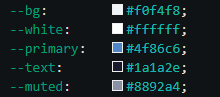

## Image Slider – Personal Lab
**Author:** Míriam Domínguez Martínez  
**Date:** 11.03.2026   
**Topic:** HTML, CSS & JavaScript – Image Slider with Loops

---

### Project Description

This project is an interactive image slider built with HTML, CSS and JavaScript. The goal of the task was to apply core JavaScript concepts in a practical way: loops (`setInterval`), DOM manipulation, and dynamic class management. The slider automatically cycles through four images every 3 seconds in an infinite loop, with smooth fade transitions and dot indicators that sync with the current slide. The slider is centered on the page with rounded corners and a floating shadow effect.

---

### File Structure
```
/
├── index.html         
├── style.css         
├── script.js
└── img/
    ├── img1.jpg
    ├── img2.jpg
    ├── img3.jpg
    ├── img4.jpg
    └── favicon.png      
└── README.md           
```

---

### Color Palette



---

*Full Stack Web Development - Personal Lab 2026.*

---

*Full Stack Web Development Course – DBE Academy, 2026.*
